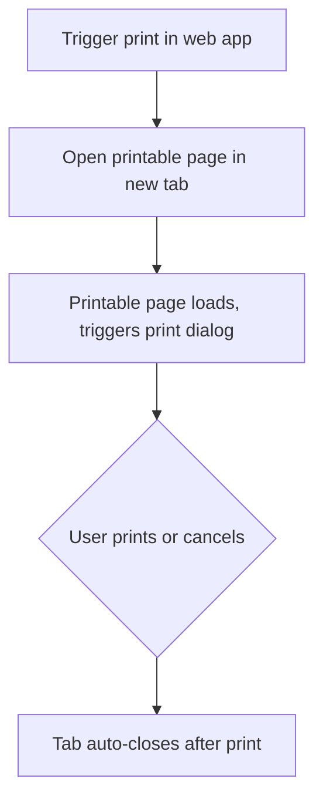

# Auto Print Web Workflow (Frontend Only)

This solution enables a seamless printing experience in web applications:

* Opens the printable page in a **new browser tab**
* Automatically triggers the **print dialog** (or silent print if configured)
* Closes the tab after printing is done

---

## 🚀 How It Works

### 1. **Open the Printable Page in a New Tab**

Trigger this JavaScript from your web app to open a printable page:

```javascript
window.open('printable-page.html', '_blank');
```

---

### 2. **Printable Page: Auto Print & Auto Close**

On your **printable page** (e.g., `printable-page.html`), include this script:

```html
<script>
window.onload = function() {
    window.print();
    window.onafterprint = function() { window.close(); };
    setTimeout(function() { window.close(); }, 1000); // Fallback
};
</script>
```

* **Result:** The print dialog appears immediately on load.
* After printing (or cancelling), the tab will close automatically.

---

## 🖨️ Silent Printing (Firefox Only, Controlled Environments)

To enable true **silent printing** (no print dialog) in Firefox, configure the browser:

1. Go to `about:config` in Firefox.
2. Set:

   * `print.always_print_silent` = `true`
   * `print.show_print_progress` = `false`
3. Restart Firefox.

**Note:**
Silent printing can only be enabled by user/admin config—web pages cannot force this on public browsers.

---

## 📝 Example Workflow



---

## ⚡ Key Points

* **No manual user interaction** required except confirming/cancelling the print dialog (unless silent print is enabled).
* **Automatic tab close** for a smoother workflow.
* **Browser-compliant**: Does not attempt to bypass browser/user security.

---

## FAQ

**Q: Can I force silent printing for all users?**
A: No, browser security restricts this to user/admin-controlled settings.

**Q: Will this work in Chrome or Edge?**
A: Auto print and tab close work, but silent printing via browser config is only available in Firefox.

---

## References

* [MDN: window.print()](https://developer.mozilla.org/en-US/docs/Web/API/Window/print)
* [Firefox Printing Preferences](https://searchfox.org/mozilla-central/source/modules/libpref/init/all.js#13931)
